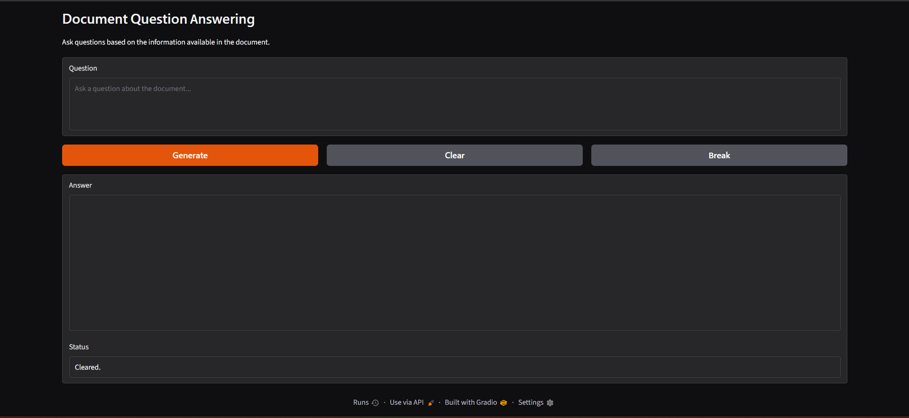

# Simple RAG Question Answering

A small Python retrieval-augmented generation (RAG) application that answers questions using the content of `data.txt` through a Gradio web interface.

The application preprocesses the document, splits it into chunks, creates vector embeddings, retrieves the three most relevant chunks for each question, and sends only that retrieved context to a language model. Hugging Face Inference is enabled by default, and Ollama is available as a local alternative.

## User Interface

The application uses [Gradio](https://www.gradio.app/) to provide the web interface for entering questions and displaying answers.



## Technology

- **Gradio** - web interface
- **FAISS** - vector similarity search
- **spaCy** - text lemmatization
- **Hugging Face Embeddings** - document and query embeddings
- **Hugging Face Inference** - hosted language model inference with `openai/gpt-oss-120b`
- **Ollama** - optional local language model inference with `llama3.1`

## How It Works

1. Loads `data.txt` when the application starts.
2. Normalizes the text and removes stop words through spaCy lemmatization.
3. Splits the document into overlapping chunks.
4. Creates embeddings with `google/embeddinggemma-300m`.
5. Stores the embeddings in a FAISS vector database in memory.
6. Retrieves the three most relevant chunks for each query.
7. Generates an answer with Hugging Face using the `openai/gpt-oss-120b` model by default, or with Ollama when the local alternative is enabled.
8. Displays the answer in the Gradio interface.

## Requirements

- Python 3.10 or newer
- The Python packages listed in `requirements.txt`
- [Ollama](https://ollama.com/)
- The Ollama `llama3.1` model
- A Hugging Face access token with permission to use Inference Providers when using the default Hugging Face path
- Internet access on the first run to download Python and Hugging Face model dependencies

## Setup

Create and activate a virtual environment:

```bash
python -m venv .venv
```

Windows PowerShell:

```powershell
.\.venv\Scripts\Activate.ps1
```

macOS/Linux:

```bash
source .venv/bin/activate
```

Install the Python dependencies:

```bash
pip install -r requirements.txt
python -m spacy download en_core_web_sm
```

### Hugging Face setup (default)

Set your Hugging Face token before running the application.

Windows PowerShell:

```powershell
$env:HF_TOKEN = "your_hugging_face_token"
```

macOS/Linux:

```bash
export HF_TOKEN="your_hugging_face_token"
```

### Ollama setup (alternative)

Install and start Ollama, then download the local language model:

```bash
ollama pull llama3.1
```

To use Ollama instead of Hugging Face, edit `generate_answer()` in `rag.py`: uncomment the `ChatOllama` implementation and comment out the `InferenceClient` implementation. Then run the application without setting `HF_TOKEN`.

## Run

Make sure `data.txt` is in the project directory and that the selected model provider is configured, then run:

```bash
python main.py
```

Gradio starts a local web interface and prints a URL in the terminal. Open that URL in a browser.

Use the following controls:

- **Generate** - retrieves context and generates an answer.
- **Clear** - clears the question, answer, and status fields.
- **Break** - cancels the current answer-generation request.

## Project Files

- `main.py` - Starts the Gradio interface and connects the UI controls to the RAG pipeline.
- `rag.py` - Contains document loading, preprocessing, chunking, embedding, retrieval, and answer generation functions.
- `data.txt` - Source document used as the knowledge base.
- `requirements.txt` - Python dependencies.

## Notes

- Answers are restricted to the retrieved text. When the context is insufficient, the model is instructed to return `Insufficient context.`
- The FAISS vector database is created in memory each time the application starts; it is not persisted between runs.
- Replace the contents of `data.txt` to ask questions about a different document.
- The first startup may take time while spaCy and the Hugging Face embedding model are loaded.
- Only one answer-generation provider is active at a time. Hugging Face is the current default; Ollama can be enabled manually in `rag.py`.
